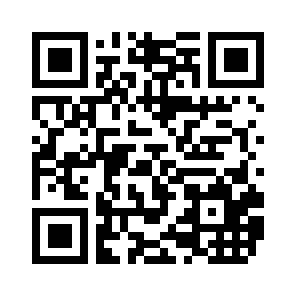

#  Winter'17 Quantum Day @ Portland
## A Day Trip to Quantum computing and Cryptography

 
*   **What**: Curious about what the new paradigm of **quantum computing** has to offer? How will it change the way computers work and how it will affect **cryptography** that we rely on for providing cybersecurity? This one-day public lectures will be your treat. World-leading experts will share their views and insights with you. This event is open to the general audience. 

*   **When**: Friday **January 13**, 2017, 9am - 4pm. 

*   **Where**: Willamette hall, [University Place Hotel and Conference
    Center](http://www.uplacehotel.com/contact-us/) at downtown Portland, OR. Directions [below](#direction).

## Program 
There will be four feature presentations and time slots for free discussion. Coffee break and light refreshement will be provided.

*  **Quantum algorithms and applications to cryptography** by [Gorjan Alagic](http://www.alagic.org/).

*  **Quantum cryptography** by [Christian Schaffner](http://homepages.cwi.nl/~schaffne/). 

*  **Non-local games** by [Zhengfeng Ji](). 

*  **Quantum Randomness Amplification** by [Kai-Min Chung](http://www.iis.sinica.edu.tw/~kmchung/). 

<!--- *   **Organizers**: 
    * [Fang Song](http://www.fangsong.info), Computer Sciecne Department, Portland State University.  -->
## How to get here?

*  **Address**: 310 SW Lincoln Street Portland, OR 97201.   Parking
available onsite as well as abundent street parking.

*  **Public transportation**: find
   info. on [Trimet](http://trimet.org/#/planner). Close to bus
   station at SW Lincoln & 1st (Stop ID: 3398), Lincoln St/SW 3rd Ave
   MAX Station (Orange line), and Portland Stree car station at SW
   Harrison Street.

## Sponsors
*  **[Maseeh College of Engineering and Computer Science](https://www.pdx.edu/cecs/)**, Portland State University. 
*  **[College of Liberal Arts and Sciences](https://www.pdx.edu/clas/)**, Portland State University. 

## More info. 
Scan the QR code or visit www.fangsong.info/w17qpdx/ for more info. 
